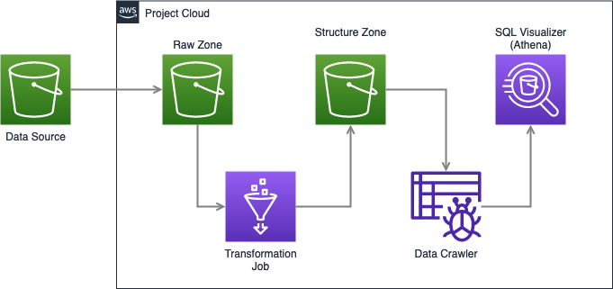

# Loka Challenge(door2door)

The following projects aims to process data daily events from a Car Service Company and stores them in a Data Warehouse. For this purpose we are going to use AWS as our cloud provider so in order to run the project we need an aws account. 

## Aproach

For this project I want to have a robust pipeline for future possible scenarios like modifying table columns or adding new table to the data warehouse, etc. That's why the whole project have a main config file where we can set this up according to the business needs.

## Architecture

 We are going to use a Raw and Strucutre zone as staging zones. The first to copy the data from the original source and the second to store the data after the transformation job so we can still have a copy o the original data for any furutre use case. We are going to use Athena as a SQL-queriable data warehouse. So the architecture will be the following:



These services will be launched and setted with terraform an Infrastructure-as-code service which let us built everything we need to run the project. For the installation please refer the following [link](https://developer.hashicorp.com/terraform/tutorials/aws-get-started/install-cli), otherwise you can launch the following services by yourself:
- S3 bucket with:
    - Raw Folder
    - Structrure Folder
    - Glue jobs Folder (with glue jobs inside)
- IAM Role for the glue jobs
- Glue Database

For the daily job execution we are going to use airflow as orchestrator with the following sequence of tasks:


The details of the tasks are the following:
- fetch_data: task for copy the data source to our first staging zone.
- process_data_glue_job: task for the transformations and modeling for the glue jobs.
- crawl_s3_operating_period: task for crawl the operating period data to our Athena warehouse.
- crawl_s3_vehicle: task for crawl the vehicle data to our Athena warehouse.

## Data

The data of the events are located in the bucket `s3://de-tech-assessment-2022/data/`

Until now we have two entities: operating period and vechicle.

For the operating period entitiy we have the variables operation_start and operation_finish which belongs to the date and time when the operating period for the renting cars starts and ends.

And for the vehicle entity we have 3 different events: register, update and deregister, only when we recieve an update we will have data for location, in the other events we won't have location data. That's why we are going to keep that records with nodata in loaction columns. 

We are only going to drop records when there's no data in event, timestamps or the identifction columns like on and organization_id. We also don't know how is going to come data in the future that's why we are setting everything up for any case of weird data in the records.


## Run the project

First of all you have to set the configuration variables in `src/airflow/config.py` file

1. Create resources with terraform.

```
cd infra/terraform
terrafrom plan 
terraform apply
```

2. Run airflow on your local or virtual machine.

```
cd src/airflow/
echo -e "AIRFLOW_UID=$(id -u)" > .env
docker-compose up 
```

Open your project [here](https://0.0.0.0:8080/home)

3. Set your aws credentials in airflow connections with the label `aws_default`. 

4. Run your dags on the airflow web service.

5. Go to Athena in your AWS account to see your data.

6. Start Querying!


## Future work

- Depending on the size and quantity of the files in the source data bucket we can replace the `_fetch_data` module and make work through a cloud function like lambda and don't overcharge our worker node.
- If the number of the entities(tables) increase, we can replace Amazon Athena and the glue jobs and use dbt and Redshift for the transformations in order to have a more detailed data warehouse.
- For testing purposes, we are using a docker configuration given by airflow testing, in a real production environment is better to have a dedicated ariflow configuration with their respective needs hosted in the cloud or instead of that a managed service like MWAA. (more expensive option although)
- In the case of adding more entities in the event table we just need to add the model in the config.py file and add the crawler configuration to send it to our Athena warehouse.