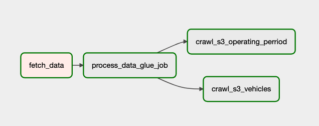

# Loka Challenge

the solution aims to process daily the data from the events in the car services 

We are going to build a module that will be executed every day and feeds the data warehouse

## Architecture

For the infrastructure cloud architecture we are going to use a Raw and Strucutre zone. The first to copy the data from the original source and the second to store the data after the transformation job so we can still have a copy o the original data for any furutre use case. We are going to use Athena as a SQL-queriable data warehouse.


For the daily job execution we are going to use airflow as orchestrator with the following sequence of tasks:



## Data

The data of the even s are located in the bucket s3://de-tech-assessment-2022/data/


## Run the project

First of all you have to set the env variables in `.env` file

1. Create resources with terraform.

```
cd infra/terraform

terrafrom plan 

terraform apply
```

2. Run airflow on your local or virtual machine.

`docker-compose up `

Open on `localhost:8080/home`

3. Set your aws credentials in airflow connections with the label `aws_default`. 

4. Run your dags on the airflow web service.

5. Enter to Athena in AWS to see your data.


## Future work

